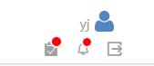
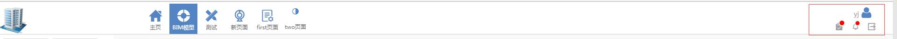
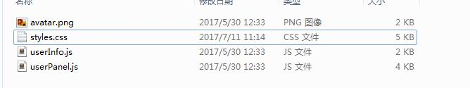

# UserPanel 组件

## 组件描述

项目界面右上角显示账号名、账户头像、退出按钮等一些信息面板。

## 页面效果

* 组件的内容如图：



* 组件的用途：



## 组件原理

* 1、组件文件结构



* 2、实现的思路

`UserPanel`组件是账号信息面板的总入口文件，它把引入的`UserInfo`组件、那三个图标都进行的布局以及绑定监听事件。`render`方法是`React`组件的`html结构`布局的生命周期函数。

`UserInfo`组件主要是用来把账号的信息展示出来以及包含账号的头像。在`UserInfo`组件中，把账号的信息是从`sessionStorage`获取，然后再显示在`render`方法里。

## 组件源码

### 1、`userPanel.js`

[import](code/userPanel.js)
<br />


### 2、`userInfo.js`

[import](code/userInfo.js)
<br />

### 3、`styles.css`

[import](code/styles.css)
<br />

## 如何使用

* 1、在项目里的`Components`文件夹里新建一个文件夹`UserPanel`，里面存放的文件就是 [组件原理](#组件原理)  的文件结构。

* 2、`userInfo.js`文件里使用了`sessionStorage.getItem("userInfo") //全局的账户登录的账号名，从sessionStorage`。

* 3、在想使用的组件的里使用：

```js
//引入声明 
import UserPanel from xxx/Components/userPanel.js;  //实际路径

//引用 
在`render`方法里使用 <UserPanel />
```