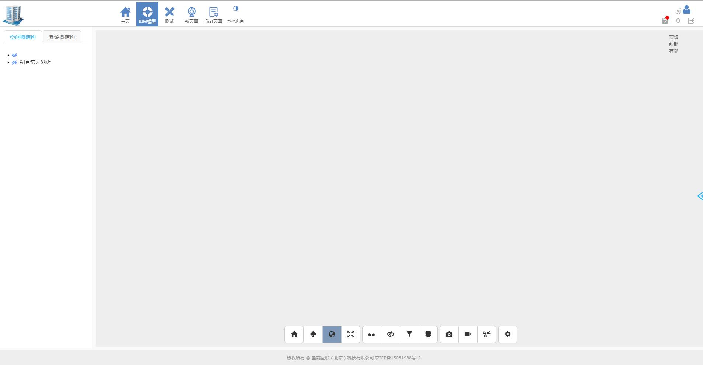

# footer 页尾 组件

## 组件描述

页面的页尾

## 页面效果

页尾内容和样式：


项目的整体页尾效果：



## 组件源码
### index.js
组件入口文件

[import](./code/index.js)

### styles.css
组件css样式 
[import](./code/styles.css)

## 源码下载

<a href="./code/Footer.zip?_blank" title="下载 Footer 组件" target="_blank">源码下载</a>


## 如何使用
* 1、在项目里的Components文件夹里新建一个文件夹Footer，里面存放的文件就是 [组件源码](#组件源码)   的文件结构。

* 2、在项目的模版页面`BasePage`的`index.js`里声明和引用`Footer`页尾组件。

```js
import Footer from '../../Components/Footer';   //声明，路径要填写正确 

<Footer />           //引用

```

## 使用示例
模版页面`BasePage`的`index.js`

[import](./code/basePage.js)

