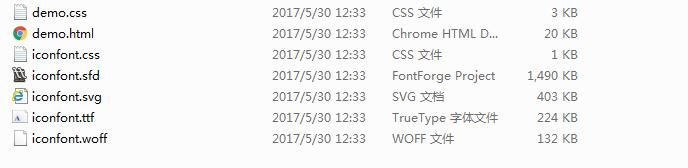

# Icons 组件

## 组件描述

自定义的 icon 图标的集合，主要是教用户如何想要的图标制作成图标字体文件以供项目使用。它的一个具体用途就是导航栏的图标实现。

## 页面效果

制作好的 Icons 图标可以在 html 页面上查看，每个图标下方标明了它的用途以及所存在的 id 位置，id 是作为图标引用的唯一标志。


## 制作步骤

### 1、获取 Icons 模版
获取盈嘉互联提供的 Icons 组件模版，文件结构如下图所示：



* `iconfont.sfd`：图标字体文件的方案文件，使用`FontForge`软件打开，是这一整个组件的核心文件。

* `iconfont.woff`：类型为 `WebOpen Font`，由`FontForge`软件生成。WOFF（Web开发字体格式）是一种专门为了Web而设计的字体格式标准，实际上是对于TrueType/OpenType等字体格式的封装，每个字体文件中含有字体以及针对字体的元数据（Metadata），字体文件被压缩，以便于网络传输。

* `iconfont.svg`：类型为 `SVG Font`，由`FontForge`软件生成。SVG是由W3C制定的开放标准的图形格式。SVG字体就是使用SVG技术来呈现字体，还有一种gzip压缩格式的SVG字体。

* `iconfont.ttf`：类型为 `TrueType`，由`FontForge`软件生成。Windows和Mac系统最常用的字体格式，其最大的特点就是它是由一种数学模式来进行定义的基于轮廓技术的字体，这使得它们比基于矢量的字体更容易处理，保证了屏幕与打印输出的一致性。同时，这类字体和矢量字体一样可以随意缩放、旋转而不必担心会出现锯齿。

* `iconfont.css`:  @font-face语句是css中的一个功能模块，用于实现网页字体多样性的模块(设计者可随意指定字体，不需要考虑浏览者电脑上是否安装)。

* `demo.html`: 制作一个页面，主要是用以把生成的图标字体显示在页面方便查阅。

* `demo.css`: demo.html的样式，主要是把图标通过样式的方式表现出来。 

### 2、安装制作图标的软件
* `FontForge`软件: Fontforge为一字体编辑、创建工具，下载并安装这个软件。这个软件需要上传的是`svg`矢量图。切记在软件的图标右键`属性`选择`兼容性`勾上`以管理员身份运行此程序`。

* `Vector Magic`: 位图转换矢量图软件,是一款非常便捷的位图转换矢量图片工具，具备自动临摹的能力来将你上传的位图图片转换成矢量图片，可以精确的把位图转换为矢量图片。

* `Adobe Illustrator CS6`: 也就是AI软件，比photoshop更高级。主要是用来把由`Vector Magic`软件生成的`svg`文件再加工一次，否则该文件放`FontForge`出不了效果。

### 3、自定义的图标转SVG文件
* 打开`Vector Magic`软件，点击右上角的`import from folder`选择自己想要制作的图标，以"百度"为例，当然，这个图标也可以是截图保存的文件。如下图：


* 然后点击右下角的`Next`按钮，一直到`保存`的界面，选择保存的文件格式为`svg`以及保存路径，再点击`save`即可，如下图：


### 4、加工第3步的SVG文件
* 打开`Adobe Illustrator CS6`软件，`Ctrl + N`新建一个宽度和高度都为`2英寸`的空白文档(假设为A1)，点确定。


* 把第3步生成的`baidu.svg`文件单击选中拖拽到AI软件里，会打开在另一个文档里(假设为A2)。


* 在A2文档里，我们需要把百度的`logo`拖拽到A1文档里。原由是由`Vector Magic`生成的`svg`文件不是透明的图标，我们要把其转换成透明的图标。
操作方式是：在A2文档里，按住`Shift`，再分别单击`logo`的每个部分，切记不要把其底部白色的背景也选上。然后按住
`Ctrl`，单击选中刚才`logo`部分，往白色背景外拖拽，就可以看到`logo`和白色背景分离了。


* `Ctrl + 单击选中 `把A2文档里分离好的`logo`拖拽到A1文档里，如图


* 在A1文档里按`Ctrl + S `保存文档，格式为`svg`，假设名字为`baidu.svg`。


### 5、制作图标字体文件
* 打开`FontForge`软件，它所能访问打开的盘符只有C盘，所以把第4步骤生成的`baidu.svg`文件以及`iconfont.sfd`放到C盘下的某个目录文件夹，在软件上选择刚才的路径，选中`iconfont.sfd`文件后点击"ok"打开。


* 图标字体能存在的位置(ID)是为`E600 至 E76B`和`E900 到最后`。每一个小表格的上方的字符就是其 `ID`。

* 假定我们选择的是`E6D1`这一个空的位置，双击这个表格，在弹出的窗口里选择`File -> Import`,再在弹出的文件选择框中选择`svg`类型选中`baidu.svg`点`import`，`import`完成后点击右上角的`关闭`。


* 关闭之后回到`fontForge`界面，可以看到`E6D1`的方格里增加了`百度logo`。如图


### 6、导出图标字体文件
* 在`FontForge`界面，选择`File -> Generate Fonts...`，在弹出的窗口中选择`TrueType`，文件名为`iconfont.ttf`，
点`Generate`按钮就会生成`iconfont.ttf`文件。


* 在`FontForge`界面，选择`File -> Generate Fonts...`，在弹出的窗口中选择`SVG font`，文件名为`iconfont.svg`，
点`Generate`按钮就会生成`iconfont.svg`文件。


* 在`FontForge`界面，选择`File -> Generate Fonts...`，在弹出的窗口中选择`Web Open Font`，文件名为`iconfont.woff`，
点`Generate`按钮就会生成`iconfont.woff`文件。


* 执行上面三步的`Generate`后，会发现文件夹里增加了三个文件，这三个文件就是应用于web的图标字体文件。


### 7、验证图标字体

* 验证是否能正常使用百度的`logo`，可以查看 [使用示例](#使用示例)。


## 源码下载

<a href="./code/IconFont.zip?_blank" title="下载 IconFont 组件" target="_blank">源码下载</a>


## 如何使用
* 根据`制作步骤`最终会生成3个图标字体文件：`iconfont.ttf`、`iconfont.svg`和`iconfont.woff`。

* 建立`iconfont.css`文件，使用css中的一个功能模块`@font-face`语句，用于实现网页字体多样性的模块。代码如下：

[import](code/iconfont.css)

* 挑选相应图标并获取字体编码，应用于页面

```html
<i class="iconfont">&#E6D1;</i>
```

## 使用示例

* 新建`demo.html`，主要是用来可以即时在页面上可查阅的文件。

[import](code/demo.html)
<br />

* 新建`demo.css`，样式为

[import](code/demo.css)
<br />

* 新建`iconfont.css`。注意： `iconfont.css`依赖`iconfont.ttf`、`iconfont.svg`和`iconfont.woff`这三个字体文件。
[import](code/iconfont.css)
<br />

* 文件结构如图


* 运行效果


