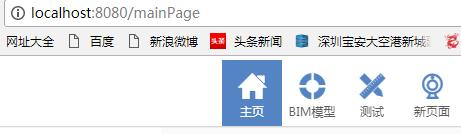
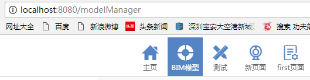

# 一级导航栏 组件

## 组件描述

导航栏，主要是进行不同页面的切换功能从而达到页面导航效果。

## 页面效果

1、点击导航栏"主页"时，"主页"这个图标，页面会跳转到"主页"所对应的page页面，其次"主页"这个图标会蓝色选中效果，同时浏览器地址栏的值的路由为`"/mainPage"`。



2、点击导航栏"BIM模型"时，"BIM模型"这个图标，页面会跳转到"主页"所对应的page页面，其次"BIM模型"这个图标会蓝色选中效果，同时浏览器地址栏的值的路由为`"/modelManager"`。



## 页面原理
1、页面的一级导航是由一个带一定格式的json对象数组生成，一个对象就是一个导航图标的信息。
```
[
    {name:'mainPage',text:'主页',current:"current"}
]
```
2、json对象包含"name"属性，这个属性的值既作为该导航图标的样式的类名，也作为导航到具体页面的路由。

3、json对象包含"text"属性，是用为显示导航的内容，"current"属性主要用来表示当前导航栏高亮哪个导航图标，值为"current"或""。

4、`componentWillMount()`函数在该组件初始化时执行，只执行一次，`componentWillReceiveProps()`函数是组件在更新时会执行，因此要在初始化以及更新时都要进行导航选中匹配的操作。

5、需要在`menus.js`里引入`Icons`这个组件，主要是引入使用`iconfont.css`图标字体文件。

## 组件源码

### index.js
1、导航组件的总入口文件 index.js
[import](code/headerContainer.js)

### menus.js
2、导航图标组件 menus.js

* [查看 Icons 组件](../../../modules/iconfont/Icons/iconfont.md)

[import](code/menus.js)

### styles.css
3、组件样式文件 styles.css
[import](code/styles.css)

## API
### headerNames
`属性：` headerNames

`说明：` 一级导航栏的菜单内容

`类型：` json对象数组 object[]

`默认值：` 非空

`示例：` 如下

```javascript
[
    {name:'mainPage',text:'主页',current:"current"},
    {name:'modelManager',text:'BIM模型',current:""},
    {name:'designMana',text:'测试',current:""},
    {name:'newPage',text:'新页面',current:""},
    {name:'firstPage',text:'first页面',current:""}
]

//"name"属性，这个属性的值既作为该导航图标的样式的类名，也作为导航到具体页面的路由。

//"text"属性，是用为显示导航的内容。

//"current"属性，主要用来表示当前导航栏高亮哪个导航图标，值为"current"或""。

```

## 使用说明
1、复制代码生成index.js、menus.js、styles.css文件。

2、在使用的页面`import Nav from '具体路径/index.js'`,在`render`方法里调用`<Nav />`即可以实现。

3、切记要在`styles.css`文件里增加导航图标的样式，假定`headerNames`值里有一个name为'test'的对象，则在css里增加：
```css
.test:before{
    font-size: 30px;
    content: "\e606";   //假定图标的id为"\e606"，具体值可以查看 Icons 组件里的html文件
}
```

## 特别说明
切记：需要在`menus.js`文件口引入 `图标字体组件 Icons`中的图标字体样式文件`iconfont.css`。

* [Icons 组件](../../../modules/iconfont/Icons/iconfont.md)

