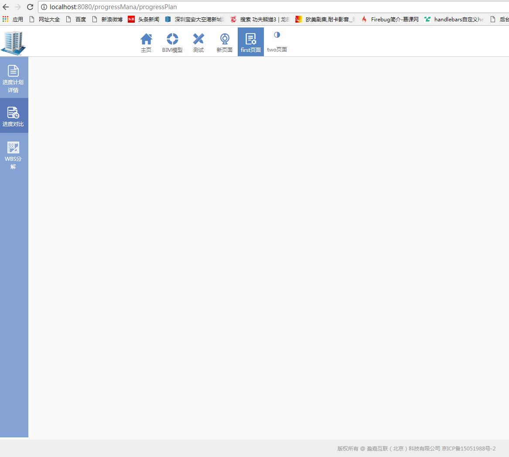
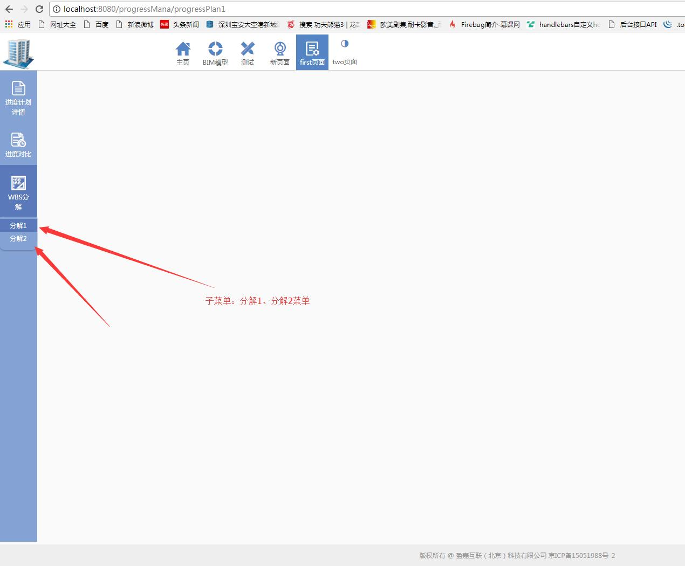
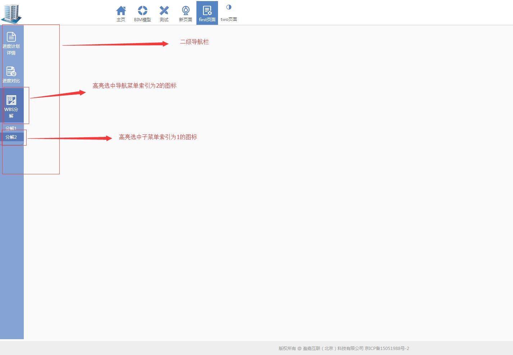

# 二级导航栏 组件

## 组件描述

导航菜单是一个网站的灵魂，用户依赖导航在各个页面中进行跳转。一般分为顶部导航和侧边导航，顶部导航提供全局性的类目和功能，侧边导航提供多级结构来收纳和排列网站架构。

因此，本页面主要是描述侧边导航组件 `SideMenu`。

## 页面效果

1、页面左侧二级导航栏。



2、当然，也支持某个二级导航菜单下还包含子菜单，点击就可以展开，切换其他就会隐藏其子菜单。



## 页面原理
1、页面的二级导航是由一个带一定格式的json对象数组生成，一个对象就是一个导航图标的信息。
```
var SIDEMENU_NAMES = [
    {name:'progressDetailPage',text:'进度计划详情',path:'/progressMana/progressDetailPage'},
    {name:'progressPlan',text:'进度对比',path:'/progressMana/progressPlan'},
    {
        name:'materialCost',text:'WBS分解',path:'/progressMana/realProgress',
        children: [
            {name:'progressPlan1',text:'分解1',path:'/progressMana/progressPlan1'},
            {name:'progressPlan2',text:'分解2',path:'/progressMana/progressPlan2'},
        ]
    }
   
];
```

其中，`name`属性：主要是配合css来显示菜单图标；

`text`：二级导航菜单显示名称；

`path`：二级导航菜单所对应跳转的页面(即跳转路由)；

`children`：可选属性，子菜单项。

2、`componentWillMount()`函数在该组件初始化时执行，需要进行根据具体路径来定位选中二级导航图标匹配的操作。因此需要在引用`SideMenu`组件的页面的`componentWillMount()`函数里执行匹配操作：

```js
componentWillMount(){
    let a = document.URL;
    let b = a.split('//')[1].split('/');
    let index=0;
    if(b[2]!=''){
        SIDEMENU_NAMES.map((item,index1)=>{
            if(item.name==b[2]){
                index=index1;
            }
        })
    }
    this.setState({index : index});
}
```

3、需要在组件里的`sideMenuIcon.js`里引入`Icons`这个组件 ([查看 Icons 组件](../../../modules/iconfont/Icons/iconfont.md))，主要是引入使用`iconfont.css`图标字体文件。

4、引入了`icon`图标字体文件后，需要在`styles.css`文件里进行图标的样式。对应的属性是`name`。

```css
.progressDetailPage:before{
	content: "\e61b";   /*对应icon图标字体文件里的图标id*/
	font-size: 32px;
}
```

## 组件源码

### index.js
1、导航组件的总入口文件 index.js
[import](code/index.js)

### sideMenuIcon.js
2、导航图标组件 sideMenuIcon.js

[import](code/sideMenuIcon.js)

### styles.css
3、组件样式文件 styles.css
[import](code/styles.css)

## API
### menuItems
`参数：` menuItems

`说明：` 二级导航栏的菜单内容

`是否必填: ` 必填

`类型：` json对象数组 object[]

`默认值：` 非空

`示例：` 如下

```javascript
[
    {name:'progressDetailPage',text:'进度计划详情',path:'/progressMana/progressDetailPage'},
    {name:'progressPlan',text:'进度对比',path:'/progressMana/progressPlan'},
    {
        name:'materialCost',text:'WBS分解',path:'/progressMana/realProgress',
        children: [
            {name:'progressPlan1',text:'分解1',path:'/progressMana/progressPlan1'},
            {name:'progressPlan2',text:'分解2',path:'/progressMana/progressPlan2'},
        ]
    }
   
]

`name`：主要是配合css来显示菜单图标；

`text`：二级导航菜单显示名称；

`path`：二级导航菜单所对应跳转的页面(即跳转路由)；

`children`：可选属性，子菜单项。

```

### selectIndex
`参数：` selectIndex

`说明：` 二级导航栏的菜单初始默认高亮选中的菜单图标索引

`是否必填: ` 必填

`类型：` Integer，从0正向开始

`默认值：` 非空

`示例：` 如下

`selectIndex={ 0 }`

### selectChildrenIndex
`参数：` selectChildrenIndex

`说明：` 二级导航栏的菜单初始默认高亮选中的子菜单图标索引

`是否必填: ` 非必填

`类型：` Integer，从0正向开始

`默认值：` 非空

`使用条件：` 需结合selectIndex，同时menuItems里需有children的对象属性

`示例：` 如下

`selectIndex={ 0 }
selectChildrenIndex={1}
`


### onSideMenuClick
`参数：` onSideMenuClick

`说明：` 二级导航栏的菜单点击触发事件

`是否必填: ` 必填

`类型：` function

`默认值：` 非空

## 源码下载

<a href="./code/SideMenu.zip?_blank" title="下载SideMenu组件" target="_blank">源码下载</a>


## 如何使用
* 1、点击 <a href="./code/SideMenu.zip?_blank" title="下载SideMenu组件" target="_blank">源码下载</a>,解压缩,把`SideMenu`文件夹复制到项目里的`Components`文件夹里。

* 2、在项目的某个页面的入口文件`***.js`里声明和引用`SideMenu`二级导航栏组件。

```js
import SideMenu from '../../Components/SideMenu/index.js';   //声明，路径要填写正确  

var SIDEMENU_NAMES = [               //声明二级导航栏菜单
    {name:'progressDetailPage',text:'进度计划详情',path:'/progressMana/progressDetailPage'},
    {name:'progressPlan',text:'进度对比',path:'/progressMana/progressPlan'},
    {
        name:'materialCost',text:'WBS分解',path:'/progressMana/realProgress',
        children: [
            {name:'progressPlan1',text:'分解1',path:'/progressMana/progressPlan1'},
            {name:'progressPlan2',text:'分解2',path:'/progressMana/progressPlan2'},
        ]
    }
   
];

componentWillMount(){    //页面执行初始化高亮选中图标 
    let a = document.URL;
    let b = a.split('//')[1].split('/');
    let index=0;
    if(b[2]!=''){
        SIDEMENU_NAMES.map((item,index1)=>{
            if(item.name==b[2]){
                index=index1;
            }
        })
    }
    this.setState({index : index});
}

//引用
<SideMenu 
    selectIndex={2}
    onSideMenuClick={(index)=>this._handleMenuClick(index)}
    menuItems={SIDEMENU_NAMES} 
    selectChildrenIndex={1}
/>         

```

3、在`SideMenu`组件里的`styles.css`文件里添加`SIDEMENU_NAMES`数组里每个对象的图标样式，以`name`值为类名。如：
```css
.progressDetailPage:before{
	content: "\e61b";
	font-size: 32px;
}
```

## 使用示例
某一个页面的index.js文件：

[import](./code/page.js)

界面运行效果图：




## 特别说明
切记：需要在`SideMenu.js`文件口引入 `图标字体组件 Icons`中的图标字体样式文件`iconfont.css`。

* [Icons 组件](../../../modules/iconfont/Icons/iconfont.md)

