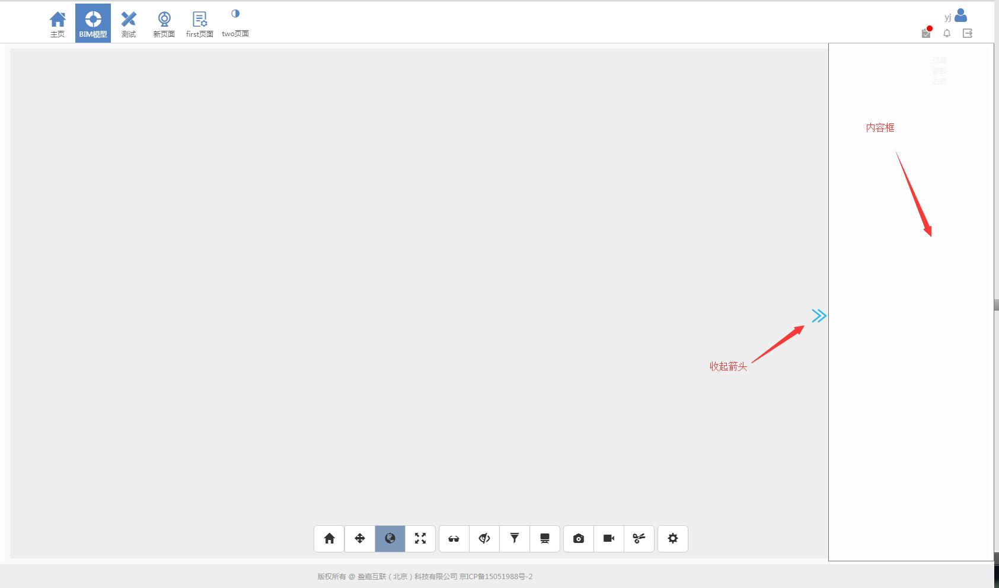

# SlideSideBar 弹出侧边栏 组件

## 组件描述
组件存在界面的最右边，点击`弹出箭头`按钮,就会从右往左弹出一个空白的内容，点击`收起箭头`，就会把空白框收起。用途主要是用来显示类似属性的内容信息。

## 页面效果
收起效果：


弹出效果：



## 组件源码
### index.js
组件入口文件

[import](./code/index.js)

### styles.css
组件css样式 
[import](./code/styles.css)

## 如何使用
* 1、在项目里的Components文件夹里新建一个文件夹`SlideSideBar`，里面存放的文件就是 [组件源码](#组件源码)   的文件结构。

* 2、在项目的某个页面的入口文件`index.js`里声明和引用`SlideSideBar`弹出侧边栏组件。

```js
import SlideSideBar from '../../Components/SlideSideBar/index.js';   //声明，路径要填写正确  

<SlideSideBar />           //引用

```

## 使用示例

* `this.props.children`是把react路由所对应的页面内容渲染到render方法里包含`this.props.children`的标签或者组件里。这样就可以把类似属性等内容放到弹出侧边栏里面。

```js
class DesignModel extends React.Component {
    constructor(props) {
        super(props);
    }
    render() {
        return (
            <div>
                <div className={sideBarStyles.listBox}>
                    <LeftTabContainer />
                </div>
                <div id="modelBox" className={styles["model-Box"]}>
                    <ModelContainer />
                    <SlideModal>
                        {this.props.children}
                    </SlideModal>
                </div>
                <AssoConfirmModalContainer />
            </div>
        )
    }
}
```

* 效果图


