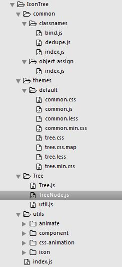
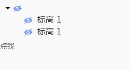

# IconTree 眼睛树 组件

## 组件描述
带有眼睛图标的树，可用于通过树节点/树眼睛图标来进行对应的模型加载、显示与隐藏的切换。使用树控件可以完整展现其中的层级关系，并具有展开收起选择等交互功能。

## 页面效果
眼睛树初始默认效果为`不可见`状态（眼睛被左斜杠贯穿）,如图：


点击眼睛图标后，将会由`不可见`状态切换成`显示`状态（不存在斜杠），如图：


## 组件源码
### index.js
组件入口文件

[import](./code/index.js)

### tree.css
样式文件

[import](./code/tree.css)

### 组件代码结构


## API Tree props

### treeData
`参数：` treeData

`说明：` 树的内容结构数据。

`是否必填: ` 必填

`类型：` json对象数组 object[]

`默认值：` -

`示例数据：` 如下

```javascript
[
    {
        "_id":"location/38838524",
        "Name":"",
        "children":[
            {
                "_id":"location/38875966",
                "Name":"标高 1",
                "children":[]
            },
            {
                "_id":"location/38838529",
                "Name":"标高 1",
                "children":[]
            }
        ]
    }
]

"_id"属性，必须，_id作为tree的key值，如果想要更改其属性名，需要在IconTree文件夹下的index.js里把所有的_id改成传入的对象数组的唯一标志值。

"Name"属性，必须，树节点的内容名称。

"children"属性，必须，值为一个数组，树的层级主要是靠此字段来进行分层。

```

### onSelect
`参数：` onSelect

`说明：` 树结点的文字单击选中触发的事件。

`是否必填: ` 必填

`类型：` function(selectedKeys, eventInfo)

`默认值：` -


### onSelectIcon
`参数：` onSelectIcon

`说明：` 树icon眼睛图标的点击触发的事件。

`是否必填: ` 必填

`类型：` function(layerKeys, eventInfo, stateType)

`默认值：` -

## 源码下载

<a href="./code/IconTree.zip?_blank" title="下载IconTree组件" target="_blank">源码下载</a>


## 如何使用
* 1、点击 <a href="./code/IconTree.zip?_blank" title="下载IconTree组件" target="_blank">源码下载</a>,解压缩,把`IconTree`文件夹复制到项目里的`Components`文件夹里。

* 2、在项目的某个页面的入口文件`***.js`里声明和引用`IconTree`眼睛树组件。

```js
import IconTree from '../../Components/IconTree/index.js';   //声明，路径要填写正确  

//引用
<IconTree
	treeData= {this.treeData}
	onSelectIcon={this.onSelectIcon}
    onSelect={this.onLocationSelect}
 />           

```

## 使用示例

[import](./code/LeftTab.js)

效果图:



